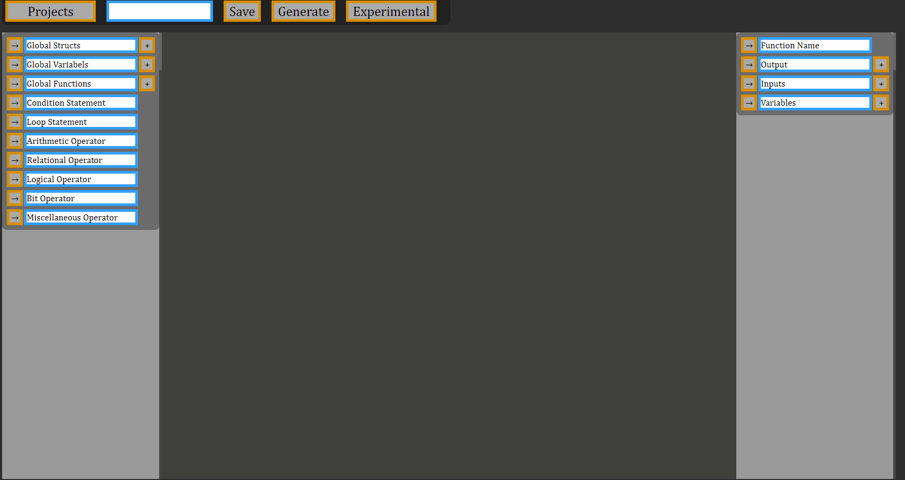

# Graphical-C-Editor-Master-Project

This is an application that generates C code with graphical programming.

## Important Features
* Self-developed SVG based GUI web framework
* Neural Network Code Generator In the experimental stage

## Run backend

    node server.js

## Url

    localhost:8080

## Create an addition function

## Linked List

## Neural Network Code Generator

